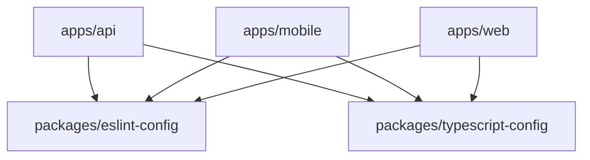
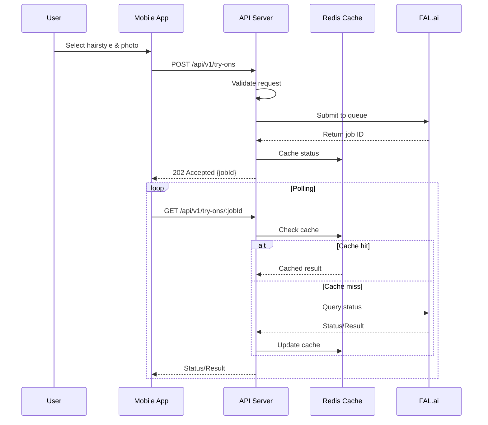
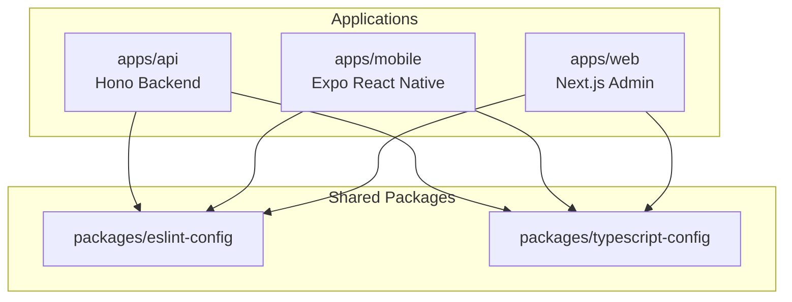
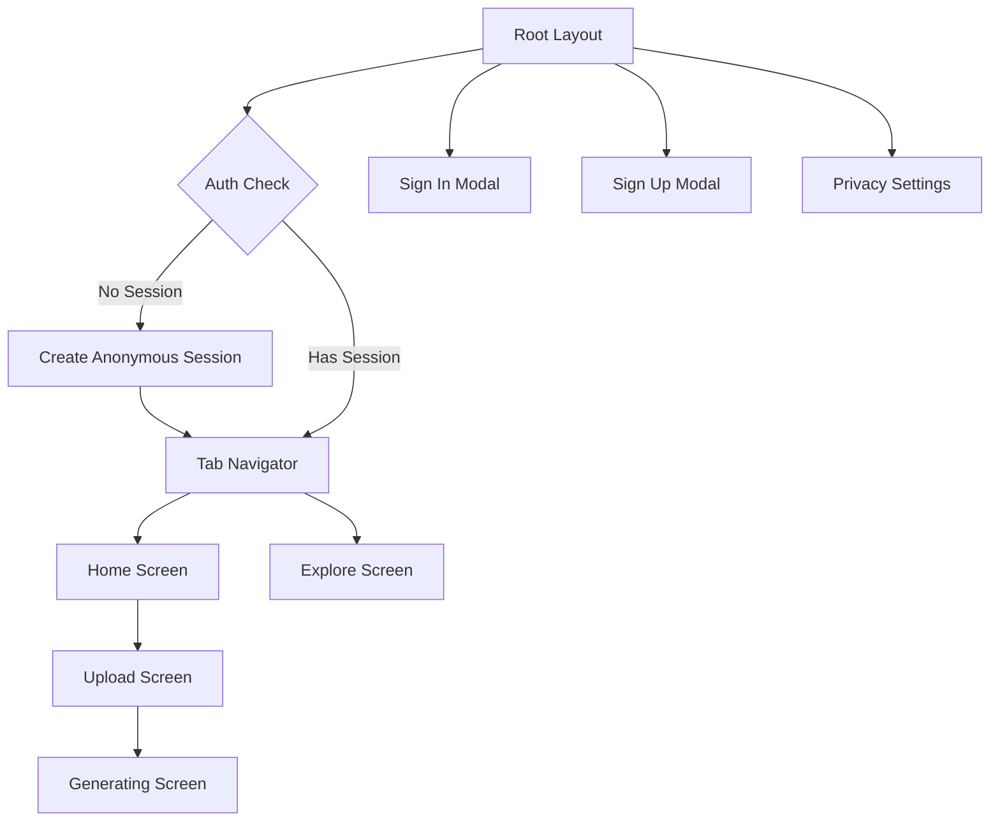
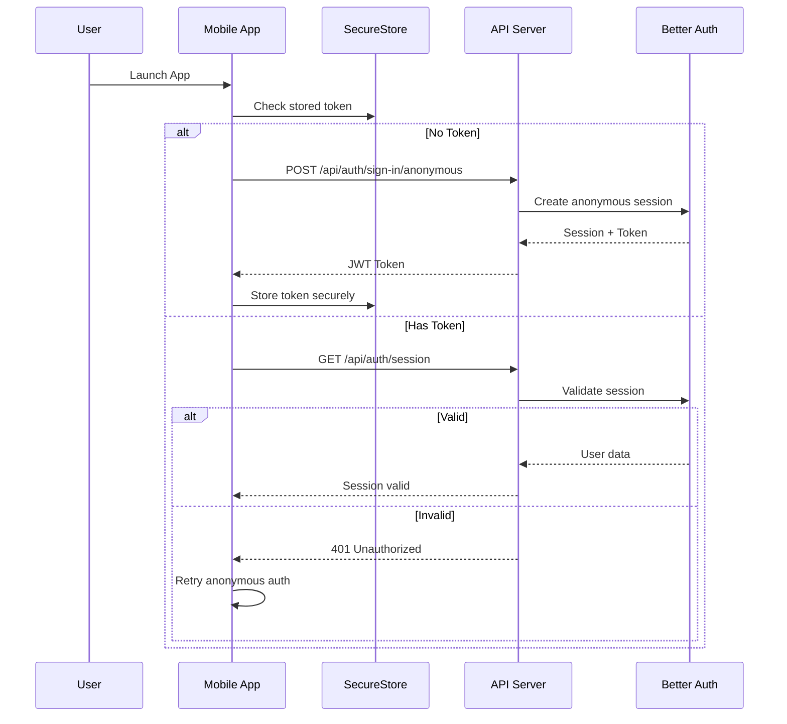

# Hairfluencer Monorepo - Comprehensive Technical Analysis

## Executive Summary

Hairfluencer is a **full-stack AI-powered hairstyle try-on application** built as a hackathon MVP using a **Turborepo monorepo** architecture. The system enables users to visualize new hairstyles using AI transformation, supporting both English and Spanish languages. The application consists of a **Hono.js backend** (TypeScript/Bun runtime), an **Expo React Native mobile app**, and a **Next.js admin panel**, all sharing common configurations through shared packages.

---

## Table of Contents

1. [Project Structure and Monorepo Architecture](#1-project-structure-and-monorepo-architecture)
2. [Backend API Discovery](#2-backend-api-discovery)
3. [Frontend Application Analysis](#3-frontend-application-analysis)
4. [AI Integration Layer](#4-ai-integration-layer)
5. [ORM and Data Layer](#5-orm-and-data-layer)
6. [Blob Storage Handling](#6-blob-storage-handling)
7. [Real-Time Communication](#7-real-time-communication)
8. [Security and Best Practices](#8-security-and-best-practices)
9. [Diagrams and Tables](#9-diagrams-and-tables)

---

## 1. Project Structure and Monorepo Architecture

### 1.1 Monorepo Package Detection

The repository follows a standard Turborepo structure with the following applications and packages:

#### Applications (`apps/`)
- **`apps/api`**: Hono.js backend server (Port 3001)
  - Purpose: RESTful API server with authentication, AI integration, and data management
  - Runtime: Bun v1.2.22

- **`apps/mobile`**: Expo React Native application
  - Purpose: Primary client application for iOS/Android
  - Framework: Expo SDK with React Native

- **`apps/web`**: Next.js 15 admin panel (Port 3000)
  - Purpose: Administrative interface for managing hairstyle gallery
  - Framework: Next.js 15 with Turbopack

#### Shared Packages (`packages/`)
- **`packages/eslint-config`**: Shared ESLint configurations
  - Purpose: Consistent code style across all applications

- **`packages/typescript-config`**: Shared TypeScript configurations
  - Purpose: Common TypeScript settings and compiler options

### 1.2 Dependency Mapping



### 1.3 Monorepo Tooling Configuration

**Turborepo Configuration (`turbo.json`)**:
```json
{
  "tasks": {
    "build": {
      "dependsOn": ["^build"],
      "outputs": [".next/**", "!.next/cache/**"]
    },
    "lint": {
      "dependsOn": ["^lint"]
    },
    "dev": {
      "cache": false,
      "persistent": true
    }
  }
}
```

**Key Features**:
- Build pipeline with dependency ordering
- Persistent dev tasks for hot-reload
- Environment variable support (`.env*` files)
- Output caching for Next.js builds

### 1.4 Package Scripts and Configuration

**Root Package Scripts**:
- `bun dev`: Start all applications concurrently
- `bun build`: Build all applications
- `bun lint`: Run linting across monorepo
- `bun format`: Format TypeScript and Markdown files
- `bun check-types`: Type check all applications

**Workspace Configuration**:
- Package Manager: Bun v1.2.22
- Workspaces: `["apps/*", "packages/*"]`
- Node Version: >=18

---

## 2. Backend API Discovery

### 2.1 REST Endpoint Enumeration

The Hono.js backend exposes the following RESTful API endpoints:

#### Authentication Routes (`/api/auth/*`)
| Method | Path | Description | Auth Required |
|--------|------|-------------|---------------|
| POST | `/api/auth/sign-in` | Email/password sign-in | No |
| POST | `/api/auth/sign-in/anonymous` | Anonymous session creation | No |
| POST | `/api/auth/sign-up` | User registration | No |
| POST | `/api/auth/sign-out` | Session termination | Yes |
| GET | `/api/auth/session` | Get current session | No |
| POST | `/api/auth/google` | Google OAuth flow | No |

#### V1 API Routes (`/api/v1/*`)
| Method | Path | Description | Auth Required |
|--------|------|-------------|---------------|
| GET | `/api/v1/hairstyles` | List all hairstyles | No |
| GET | `/api/v1/hairstyles/:styleId` | Get specific hairstyle | No |
| POST | `/api/v1/hairstyles` | Create new hairstyle (admin) | Yes |
| POST | `/api/v1/try-ons` | Submit AI transformation | Yes |
| GET | `/api/v1/try-ons/:jobId` | Get transformation status | Yes |
| GET | `/api/v1/favorites` | List user favorites | Yes |
| POST | `/api/v1/favorites` | Add favorite | Yes |
| DELETE | `/api/v1/favorites/:favoriteId` | Remove favorite | Yes |
| GET | `/api/v1/health` | Health check | No |

### 2.2 Route Handlers and Middleware

**Global Middleware Stack**:
1. **CORS Middleware** (`apps/api/src/index.ts:15-22`)
   - Allows configurable origins
   - Supports credentials
   - Methods: GET, POST, PUT, DELETE, OPTIONS

2. **Session Middleware** (`apps/api/src/index.ts:25-53`)
   - Attaches user/session to context
   - Skips auth routes for optimization
   - Uses Better Auth session validation

3. **Rate Limiting** (`apps/api/src/middleware/rate-limit.ts`)
   - Anonymous sign-in: Special rate limits
   - General API: 20 requests/minute per client
   - Try-on endpoints: Max 5 concurrent jobs per user

**Route-Specific Middleware**:
- **`requireAuth`**: Protects authenticated endpoints
- **Request validation**: Zod schemas for body validation (implied)
- **Try-on validation**: Custom validation for AI requests

### 2.3 WebSocket Implementation

**Current Status**: No WebSocket implementation detected in the current codebase. The system uses polling for AI job status updates rather than real-time WebSocket connections.

### 2.4 Request/Response Validation

**Try-On Request Schema**:
```typescript
{
  prompt: string (required),
  imageUrls: string[] (required, max 10),
  numImages?: number (1-4),
  outputFormat?: 'jpeg' | 'png',
  syncMode?: boolean,
  priority?: 'low' | 'normal',
  webhookUrl?: string,
  hint?: string
}
```

**Validation Rules**:
- Max request body size: 32KB
- Max URL length: 2048 characters
- Image URLs must be valid HTTP/HTTPS
- Configurable host whitelisting via `FAL_ALLOWED_IMAGE_HOSTS`

### 2.5 Authentication & Authorization

**Better Auth Integration**:
- **Setup**: `apps/api/src/auth.ts`
- **Session Duration**: 7 days (mobile-optimized)
- **Providers**: Email/password, Google OAuth, Anonymous
- **Token Storage**: JWT-based with secure secrets
- **Anonymous Accounts**: Auto-cleanup job after 30 days

**Authorization Levels**:
- Public endpoints (no auth required)
- Authenticated endpoints (valid session required)
- Admin endpoints (future implementation)

---

## 3. Frontend Application Analysis

### 3.1 Expo Router Navigation Structure

**File-Based Routing** (`apps/mobile/app/`):

```
app/
├── _layout.tsx           # Root layout with auth hook
├── (tabs)/              # Tab navigator group
│   ├── _layout.tsx      # Tab configuration
│   ├── index.tsx        # Home screen
│   └── explore.tsx      # Explore screen
├── sign-in.tsx          # Modal: Sign in
├── sign-up.tsx          # Modal: Sign up
├── upload.tsx           # Upload/camera screen
├── generating.tsx       # AI processing screen
├── privacy-settings.tsx # Privacy settings
└── +not-found.tsx      # 404 handler
```

**Navigation Pattern**:
- Tab-based main navigation (Home, Explore)
- Modal presentation for auth screens
- Stack navigation for detail screens
- Deep linking support: `hairfluencer://`

### 3.2 Navigation Guards & Auth Flow

**Anonymous Authentication Hook** (`useAnonymousAuth`):
- Auto-creates anonymous sessions on app launch
- Stores session in Expo SecureStore
- Handles session refresh and expiration
- Upgrades to full accounts optional

**Auth Flow**:
1. App launches → Check stored session
2. No session → Create anonymous session
3. Anonymous session → Full app access
4. Optional upgrade → Email/Google sign-in

### 3.3 API Calls & Data Fetching

**Auth Client** (`apps/mobile/lib/auth-client.ts`):
```typescript
- Base URL: process.env.EXPO_PUBLIC_API_URL || 'http://localhost:3001'
- Plugins: expoClient, anonymousClient
- Storage: Expo SecureStore (secure keychain)
```

**State Management** (`apps/mobile/stores/`):
- **`useStore.ts`**: Zustand store for app state
  - Selected category/hairstyle
  - Search query
  - Favorites management
  - UI preferences

- **`useApi.ts`**: API interaction layer (planned)

### 3.4 UI Components and Styling

**Component Architecture**:
- **Custom Components**:
  - `HairstyleCard`: Display hairstyle with favorite action
  - `LoadingSkeletons`: Loading states
  - `ImageWithFallback`: Error handling for images
  - `OptimizedImage`: Performance-optimized images

**Styling Approach**:
- React Native StyleSheet API
- Linear gradients for visual effects
- Platform-specific adjustments (iOS/Android)
- Responsive design with Dimensions API

### 3.5 File/Media Handling

**Image Selection Flow**:
1. User taps upload → Navigate to `/upload`
2. Select from gallery or camera (planned)
3. Image validation and preview
4. Submit to API with hairstyle selection

**Permissions** (Planned):
- Camera access for selfies
- Photo library access for uploads

---

## 4. AI Integration Layer

### 4.1 AI Service Provider

**Primary Provider**: FAL.ai Platform
- **Model**: `nano-banana/edit` (configurable via `FAL_MODEL_ID`)
- **Integration**: Queue-based async processing
- **Client**: `@fal-ai/client` SDK

### 4.2 AI Workflow Architecture



### 4.3 AI Request Processing

**Service Layer** (`apps/api/src/services/hairstyle-generation.ts`):

1. **Request Submission**:
   - Build nano-banana input payload
   - Submit to FAL.ai queue
   - Cache initial status
   - Return job ID to client

2. **Status Checking**:
   - Check Redis cache first
   - Query FAL.ai if cache miss
   - Update cache with results
   - Support for progress logs

3. **Result Handling**:
   - Completed results cached in Redis
   - Image URLs returned to client
   - Metrics tracked (inference time)

### 4.4 Resilience Features

**Retry Logic** (`apps/api/src/services/fal-retry.ts`):
- Max attempts: 3 (configurable)
- Exponential backoff: 500ms → 5000ms
- Circuit breaker: 5 failures → 30s cooldown

**Caching Strategy** (`apps/api/src/services/try-on-cache.ts`):
- Status responses cached
- Completed results persisted
- Cache invalidation on errors
- Redis with fallback to in-memory

### 4.5 Rate Limiting & Quotas

**Per-User Limits**:
- 20 requests/minute rate limit
- Max 5 concurrent transformations
- 30-minute job TTL
- Queue position tracking

---

## 5. ORM and Data Layer

### 5.1 Drizzle ORM Integration

**Database**: PostgreSQL with Drizzle ORM

**Connection Management** (`apps/api/src/db/index.ts`):
```typescript
- Connection pool: max 10 clients
- Idle timeout: 30 seconds
- Connection timeout: 10 seconds
- Error handling with logging
```

### 5.2 Schema Definitions

**Auth Schema** (`auth-schema.ts` - Better Auth managed):
- `user`: User accounts
- `session`: Active sessions
- `account`: OAuth connections
- `verification`: Email verification

**Hairstyle Schema** (`hairstyle-schema.ts`):
```typescript
hairstyle {
  id: text (primary key)
  slug: text (unique)
  gender: enum ['man', 'woman']
  nameEn: text
  nameEs: text (optional)
  descriptionEn: text (optional)
  descriptionEs: text (optional)
  thumbnailUrl: text
  isPremium: boolean (default: false)
  isActive: boolean (default: true)
  displayOrder: integer (optional)
  createdAt: timestamp
  updatedAt: timestamp
}
```

### 5.3 Redis Integration

**Redis Client** (`apps/api/src/services/redis-client.ts`):
- **Connection**: `REDIS_URL` or host:port (default 127.0.0.1:6378)
- **Features**:
  - Lazy connection with timeout
  - Graceful degradation if unavailable
  - Error handling without crashes

**Usage**:
- AI job status caching
- Result storage for completed transformations
- Future: Session storage, rate limiting

### 5.4 Database Operations

**Current Implementation**:
- Drizzle for schema definition
- PostgreSQL as primary database
- Redis for caching layer
- Connection pooling for performance

**Planned Features**:
- User favorites persistence
- Try-on history tracking
- Analytics data storage

---

## 6. Blob Storage Handling

### 6.1 Current Implementation

**Status**: Blob storage configuration exists but not fully implemented.

**Planned Architecture**:
- Multiple provider support (S3, Minio, R2, GCS, Azure)
- Environment-based provider selection
- Presigned URLs for direct uploads
- CDN integration for serving

### 6.2 Storage Configuration

**Environment Variables**:
```bash
STORAGE_PROVIDER=s3|minio|r2|gcs|azure
S3_BUCKET_NAME=
S3_ACCESS_KEY=
S3_SECRET_KEY=
# Additional provider-specific configs
```

### 6.3 Upload Flow (Planned)

1. Client requests upload URL
2. Backend generates presigned URL
3. Client uploads directly to storage
4. Backend records file metadata
5. CDN URL returned for access

---

## 7. Real-Time Communication

### 7.1 Current Status

**WebSocket**: Not implemented in current version
**Alternative**: Polling-based status updates for AI jobs

### 7.2 Polling Architecture

**Client Side**:
- Poll `/api/v1/try-ons/:jobId` for status
- Configurable poll interval
- Stop on completion/error

**Server Side**:
- Redis cache reduces FAL.ai API calls
- Queue position updates
- Progress percentage tracking

### 7.3 Push Notifications (Planned)

**Infrastructure**:
- Expo Notifications setup exists
- Token registration endpoint planned
- Background job completion alerts

---

## 8. Security and Best Practices

### 8.1 Authentication Security

**Token Management**:
- JWT with `BETTER_AUTH_SECRET` (32+ chars)
- 7-day session duration
- Secure storage in Expo SecureStore
- Anonymous account cleanup job

### 8.2 API Security

**Request Validation**:
- Input sanitization with type checking
- URL validation for image inputs
- Request size limits (32KB)
- Host whitelisting support

**Rate Limiting**:
- Per-endpoint rate limits
- User-based quotas
- Circuit breaker for external APIs

### 8.3 Environment Security

**Secrets Management**:
- All sensitive data in environment variables
- No hardcoded credentials
- Separate configs for dev/prod

**CORS Configuration**:
- Configurable trusted origins
- Credentials support
- Proper header exposure

### 8.4 Best Practices Adherence

**Strengths**:
✅ Monorepo architecture for code sharing
✅ TypeScript throughout
✅ Environment-based configuration
✅ Error handling and logging
✅ Rate limiting and circuit breakers
✅ Secure token storage

**Areas for Improvement**:
- Add comprehensive testing suite
- Implement request signing for uploads
- Add API documentation (OpenAPI)
- Enhance monitoring and metrics
- Implement WebSocket for real-time updates

---

## 9. Diagrams and Tables

### 9.1 Monorepo Dependency Graph



### 9.2 Mobile Navigation Structure



### 9.3 Authentication Flow



### 9.4 REST API Endpoint Summary

| Category | Endpoint | Method | Auth | Description |
|----------|----------|--------|------|-------------|
| **Auth** | `/api/auth/sign-in` | POST | No | Email/password login |
| | `/api/auth/sign-in/anonymous` | POST | No | Anonymous session |
| | `/api/auth/sign-up` | POST | No | User registration |
| | `/api/auth/google` | POST | No | Google OAuth |
| | `/api/auth/session` | GET | No | Get current session |
| **Hairstyles** | `/api/v1/hairstyles` | GET | No | List all styles |
| | `/api/v1/hairstyles/:id` | GET | No | Get specific style |
| **Try-Ons** | `/api/v1/try-ons` | POST | Yes | Submit AI job |
| | `/api/v1/try-ons/:jobId` | GET | Yes | Check job status |
| **Favorites** | `/api/v1/favorites` | GET | Yes | List favorites |
| | `/api/v1/favorites` | POST | Yes | Add favorite |
| | `/api/v1/favorites/:id` | DELETE | Yes | Remove favorite |
| **System** | `/api/v1/health` | GET | No | Health check |

### 9.5 AI Integration Components

| Component | Technology | Purpose | Configuration |
|-----------|------------|---------|---------------|
| **AI Provider** | FAL.ai | Hairstyle transformation | `FAL_API_KEY` |
| **Model** | nano-banana/edit | Image editing AI | `FAL_MODEL_ID` |
| **Queue System** | FAL.ai Queue | Async processing | Built-in |
| **Cache Layer** | Redis | Status/result cache | `REDIS_URL` |
| **Retry Logic** | Custom | Resilience | 3 attempts, exponential backoff |
| **Circuit Breaker** | Custom | Failure protection | 5 failures → 30s cooldown |

### 9.6 Frontend to API Mapping

| Screen/Component | API Calls | Data Flow |
|------------------|-----------|-----------|
| **App Launch** | `POST /api/auth/sign-in/anonymous` | Create session if needed |
| **Home Screen** | `GET /api/v1/hairstyles` | Load style gallery |
| **Upload Screen** | `POST /api/v1/try-ons` | Submit transformation |
| **Generating Screen** | `GET /api/v1/try-ons/:jobId` | Poll for results |
| **Favorites Tab** | `GET /api/v1/favorites` | Load user favorites |
| | `POST /api/v1/favorites` | Add favorite |
| | `DELETE /api/v1/favorites/:id` | Remove favorite |

### 9.7 Environment Variables Reference

| Category | Variable | Description | Required |
|----------|----------|-------------|----------|
| **Database** | `DATABASE_URL` | PostgreSQL connection | Yes |
| **Auth** | `BETTER_AUTH_SECRET` | JWT secret (32+ chars) | Yes |
| | `BETTER_AUTH_URL` | Auth service URL | Yes |
| | `FRONTEND_URL` | Frontend URL for CORS | Yes |
| | `GOOGLE_CLIENT_ID` | Google OAuth ID | No |
| | `GOOGLE_CLIENT_SECRET` | Google OAuth secret | No |
| **AI** | `FAL_API_KEY` | FAL.ai API key | Yes |
| | `FAL_MODEL_ID` | AI model identifier | No |
| | `FAL_ALLOWED_IMAGE_HOSTS` | Whitelisted hosts | No |
| **Cache** | `REDIS_URL` | Redis connection | No |
| **Mobile** | `EXPO_PUBLIC_API_URL` | API URL for mobile | Yes |
| | `EXPO_PUBLIC_DEEP_LINK_SCHEME` | Deep link scheme | No |

---

## Conclusion

The Hairfluencer monorepo represents a well-architected hackathon MVP that successfully integrates modern technologies:

- **Turborepo** for efficient monorepo management
- **Hono.js** for high-performance backend
- **Expo** for cross-platform mobile development
- **Better Auth** for flexible authentication
- **FAL.ai** for AI-powered transformations
- **PostgreSQL + Drizzle** for data persistence
- **Redis** for caching and performance

The architecture is production-ready with proper error handling, rate limiting, and security measures, while maintaining flexibility for rapid feature development during the hackathon phase.