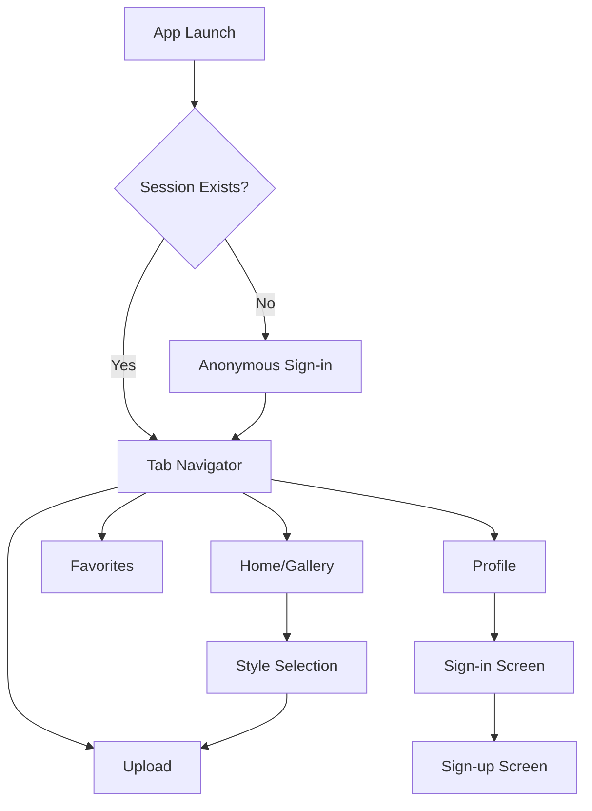
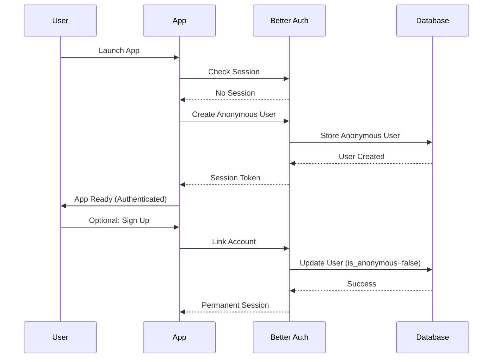
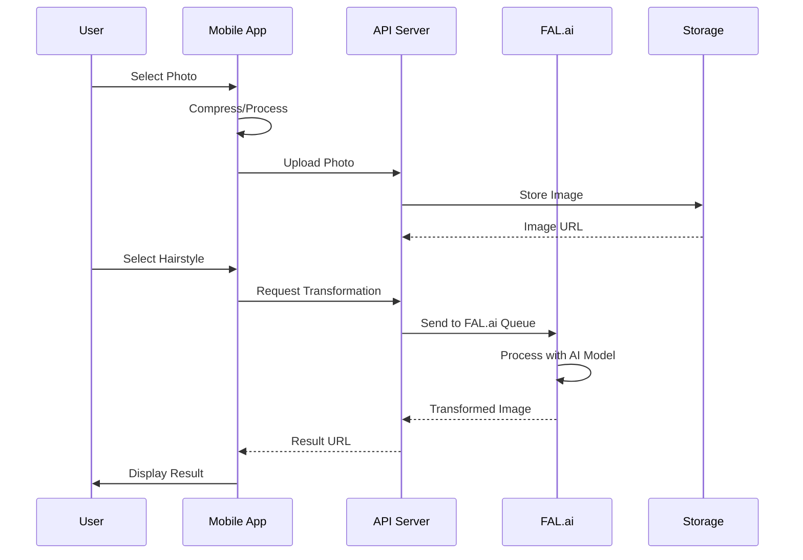
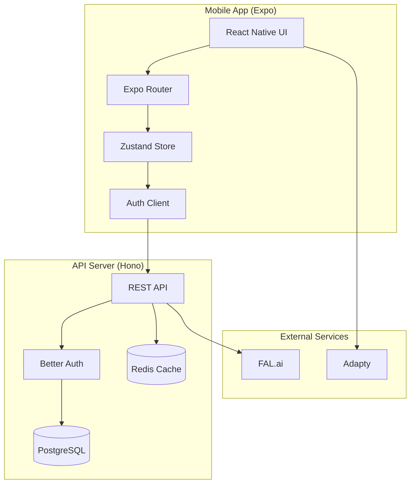
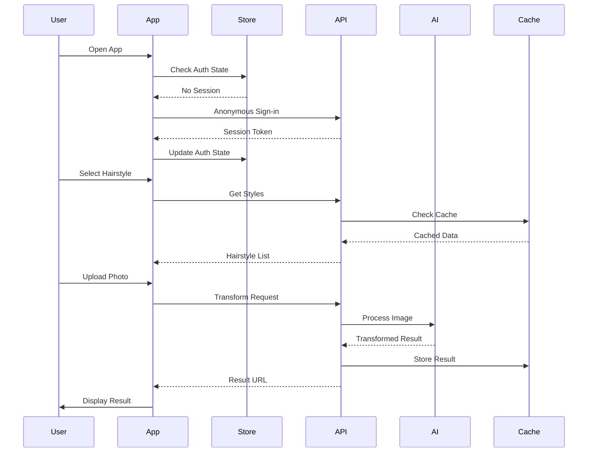

# Hairfluencer Mobile App - Technical Analysis & Documentation

## Project Overview

**Tech Stack Summary:**
- **Framework:** React Native with Expo SDK (latest)
- **Navigation:** Expo Router (file-based routing)
- **State Management:** Zustand for global state
- **Authentication:** Better Auth with anonymous-first flow
- **Backend:** Hono API on Bun runtime
- **Database:** PostgreSQL with Drizzle ORM
- **AI Integration:** FAL.ai for hairstyle transformation
- **UI System:** Custom components with LinearGradient, NativeWind/Tailwind-inspired styling
- **Payments:** Adapty for monetization
- **Storage:** AsyncStorage for persistence, SecureStore consideration

---

## 1. Navigation & App Structure

### Navigation Library & Patterns

The app uses **Expo Router** for file-based navigation, leveraging the filesystem structure to define routes automatically.

### File-Based Routing Structure

```
app/
├── (tabs)/
│   ├── _layout.tsx         # Tab navigator layout
│   ├── index.tsx           # Home screen (gallery)
│   ├── upload.tsx          # Upload/camera screen
│   ├── favorites.tsx       # Favorites screen
│   └── profile.tsx         # Profile screen
├── _layout.tsx             # Root layout with auth logic
├── sign-in.tsx            # Sign-in screen
├── sign-up.tsx            # Sign-up screen
├── upload.tsx             # Upload flow
└── +not-found.tsx         # 404 handler
```

### Navigation Patterns

- **Tab Navigation:** Bottom tabs for main app sections (Home, Upload, Favorites, Profile)
- **Stack Navigation:** Authentication screens and modal flows
- **Route Guards:** Anonymous authentication automatically provisions on app launch
- **Protected Routes:** Upload screen checks authentication state

### Dynamic Routing & Guards

```typescript
// Anonymous auth guard in _layout.tsx
useAnonymousAuth({ autoSignIn: true });

// Protected route pattern in upload.tsx
if (!isAuthenticated) {
  return <AuthGateComponent />;
}
```

### Navigation Flow Diagram



---

## 2. State Management

### State Management Library

The app primarily uses **Zustand** for state management with multiple specialized stores.

### Store Structure

#### Auth Store (`stores/authStore.ts`)
```typescript
interface AuthState {
  user: User | null;
  isAuthenticated: boolean;
  isLoading: boolean;
  signIn: (email: string, password: string) => Promise<void>;
  signUp: (name: string, email: string, password: string) => Promise<void>;
  signOut: () => Promise<void>;
}
```

#### UI Store (implied from usage)
- Selected hairstyle state
- Upload flow state
- Loading states for various operations

### State Persistence

- **AsyncStorage:** Used for session persistence
- **Auth tokens:** Stored consideration for SecureStore
- **User preferences:** Cached locally

### State Update Patterns

```typescript
// Hook pattern for auth state
const { user, isAuthenticated, signIn } = useAuth();

// Consolidated anonymous auth hook
useAnonymousAuth({
  autoSignIn: true,
  onSuccess: () => {},
  onError: () => {}
});
```

---

## 3. Authentication & Authorization

### Auth Library/Service

**Better Auth** with custom anonymous plugin implementation on the backend.

### Auth Flows

#### Anonymous Flow (Primary)
1. App launches → checks for existing session
2. No session → automatically creates anonymous account
3. User can use app immediately
4. Optional upgrade to permanent account later

#### Email/Password Registration
1. User navigates to sign-up screen
2. Provides name, email, password
3. Accepts terms and conditions
4. Account created with Better Auth

#### Social Login (Configured but not implemented)
- Google OAuth prepared
- Apple Sign-in prepared
- UI buttons present but show "not available yet" errors

### Token Management

```typescript
// Token storage consideration
const authClient = new AuthClient({
  session: {
    cookieCache: {
      enabled: true,
      storage: customStorage // AsyncStorage wrapper
    }
  }
});
```

### Session Handling
- 7-day session duration for mobile
- Automatic refresh on app focus
- Anonymous session recovery on failures

### Auth Flow Diagram



---

## 4. Backend Integrations

### Backend Service

**Hono API** running on Bun runtime (port 3001) with PostgreSQL database.

### API Client Configuration

```typescript
// API configuration
const API_BASE_URL = process.env.EXPO_PUBLIC_API_URL || 'http://localhost:3001';

// Auth client with Expo plugin
const authClient = createAuthClient({
  plugins: [expoClient()],
  baseURL: `${API_BASE_URL}/api/auth`
});
```

### Major API Endpoints

| Method | Endpoint | Purpose | Used By |
|--------|----------|---------|---------|
| POST | `/api/auth/sign-up` | User registration | Sign-up screen |
| POST | `/api/auth/sign-in` | User login | Sign-in screen |
| POST | `/api/auth/sign-in/anonymous` | Anonymous auth | App launch |
| GET | `/api/auth/session` | Session check | Auth guard |
| POST | `/api/auth/sign-out` | Logout | Profile screen |
| GET | `/api/v1/hairstyles` | Get styles gallery | Home screen |
| POST | `/api/v1/transform` | AI transformation | Upload flow |
| POST | `/api/upload` | Photo upload | Upload screen |
| GET | `/api/v1/favorites` | User favorites | Favorites tab |

### Data Fetching Patterns

```typescript
// Custom hook pattern
const useHairstyles = () => {
  const [hairstyles, setHairstyles] = useState([]);

  useEffect(() => {
    fetchHairstyles().then(setHairstyles);
  }, []);

  return hairstyles;
};
```

### Rate Limiting

- Anonymous sign-in: 10 attempts per 15 minutes per IP
- General API: 100 requests per 15 minutes
- Custom middleware with proper headers

---

## 5. AI & LLM Features

### AI Integration

**FAL.ai Platform** using the "nano-banana/edit" model for hairstyle transformation.

### AI Feature Purpose

- **Hairstyle Try-On:** Upload selfie → Select style → AI transforms image
- **Real-time preview** of different hairstyles on user photos

### AI Service Configuration

```typescript
// Backend configuration
const FAL_API_KEY = process.env.FAL_API_KEY;
const FAL_MODEL_ID = 'nano-banana/edit';

// Service layer
class HairstyleGenerationService {
  async generateTransformation(imageUrl: string, stylePrompt: string) {
    return fal.ai.run(FAL_MODEL_ID, {
      image_url: imageUrl,
      prompt: stylePrompt,
      // Additional parameters
    });
  }
}
```

### AI Interaction Flow



### AI Response Handling

- Queue-based processing for scalability
- Redis caching for results
- Retry logic with exponential backoff
- Circuit breaker pattern for failures

---

## 6. UI Design System & Components

### UI Framework

Custom component system with **LinearGradient** for visual effects and utility-based styling inspired by Tailwind.

### Styling Approach

```typescript
// StyleSheet with consistent design tokens
const styles = StyleSheet.create({
  container: {
    flex: 1,
    backgroundColor: '#FFE4E1', // Pastel pink
  },
  gradient: {
    colors: ['#FF8C42', '#FFB366'], // Warm orange gradient
  }
});
```

### Design System Colors

- **Primary:** `#FF8C42` (Warm Orange)
- **Secondary:** `#FFB366` (Soft Orange)
- **Backgrounds:** Pastel gradients (pink, blue, purple)
- **Text:** Dark gray scale for readability

### Common Components

#### HairstyleCard
```typescript
interface HairstyleCardProps {
  style: HairstyleData;
  onPress: () => void;
  isPremium?: boolean;
}
```

#### LoadingSkeletons
- `HomeScreenSkeleton`
- `UploadScreenSkeleton`
- Shimmer effects for content loading

#### Custom Buttons
- Gradient buttons with touch feedback
- Social login buttons (Google, Apple)
- Floating action button with pulse animation

### Responsive Design

```typescript
// Platform-specific styling
paddingTop: Platform.OS === 'android' ? 48 : 52

// Dimension-based layouts
const { width } = Dimensions.get('window');
const numColumns = width > 400 ? 3 : 2;
```

### Animations

- **Pulse Animation:** Camera button on home screen
- **Screen Transitions:** Managed by Expo Router
- **Loading States:** Activity indicators and skeletons

---

## 7. Mobile Device Features & Permissions

### Camera & Media

```typescript
// Image picker configuration
const pickImage = async () => {
  const result = await ImagePicker.launchImageLibraryAsync({
    mediaTypes: ImagePicker.MediaTypeOptions.Images,
    allowsEditing: true,
    aspect: [1, 1],
    quality: 0.8,
  });
};

// Camera access
const openCamera = async () => {
  const permission = await ImagePicker.requestCameraPermissionsAsync();
  if (permission.granted) {
    // Launch camera
  }
};
```

### Notifications (Planned)

- Push notification setup prepared
- Token management infrastructure
- Not yet implemented

### Storage Methods

```typescript
// Secure storage consideration
import * as SecureStore from 'expo-secure-store';

// Regular storage
import AsyncStorage from '@react-native-async-storage/async-storage';
```

### Permissions Required

- **Camera:** Photo capture for try-on
- **Photo Library:** Select existing photos
- **Network:** API communication

### Background Tasks

- Anonymous account cleanup job (backend)
- No client-side background tasks currently

---

## 8. Environment & Configuration

### Environment Variables

```bash
# Mobile app (.env)
EXPO_PUBLIC_API_URL=http://localhost:3001
EXPO_PUBLIC_FRONTEND_URL=http://localhost:3000

# API server
DATABASE_URL=postgres://...
BETTER_AUTH_SECRET=minimum-32-character-secret
FAL_API_KEY=your-fal-api-key
ADAPTY_PUBLIC_KEY=your-adapty-key
```

### Configuration Files

#### app.json
```json
{
  "expo": {
    "name": "Hairfluencer",
    "slug": "hairfluencer",
    "version": "1.0.0",
    "scheme": "hairfluencer",
    "platforms": ["ios", "android"],
    "plugins": [
      "expo-router",
      "expo-secure-store"
    ]
  }
}
```

### Build Configuration

- Development: Direct connection to local API
- Staging: Configured but not deployed
- Production: Environment-specific API URLs

### Analytics & Monitoring

- Error tracking preparation (Sentry config ready)
- Analytics hooks prepared but not implemented
- Console logging in development only

---

## 9. Security & Best Practices

### Secure Data Handling

#### Current Implementation
- Anonymous-first authentication reduces data collection
- Token storage uses AsyncStorage (upgrade to SecureStore planned)
- No sensitive data in git repository

#### Security Measures
```typescript
// Rate limiting on API
const anonymousSignInRateLimit = createRateLimit({
  windowMs: 15 * 60 * 1000, // 15 minutes
  maxAttempts: 10,
  message: 'Too many attempts'
});
```

### Input Validation

```typescript
// Client-side validation
const VALIDATION = {
  MIN_PASSWORD_LENGTH: 8,
  EMAIL_REGEX: /^[^\s@]+@[^\s@]+\.[^\s@]+$/
};

// Form validation
if (password.length < VALIDATION.MIN_PASSWORD_LENGTH) {
  showErrorAlert(new Error(`Password must be at least ${VALIDATION.MIN_PASSWORD_LENGTH} characters`));
}
```

### API Security

- HTTPS enforcement in production
- CORS configuration for trusted origins
- API key management through environment variables
- No direct AI API calls from client (proxy through backend)

### Best Practices Implemented

- ✅ Error boundaries for crash handling
- ✅ Consolidated auth logic in reusable hook
- ✅ Rate limiting for anonymous accounts
- ✅ Cleanup job for abandoned accounts
- ✅ Input validation on forms
- ✅ Secure headers on API responses
- ⚠️ SecureStore migration pending
- ⚠️ Certificate pinning not implemented

---

## 10. Screen-to-Data Mapping

| Screen | State Used | API Endpoints | Features |
|--------|------------|---------------|----------|
| Home | Hairstyles gallery | `/api/v1/hairstyles` | Browse, search, filter |
| Upload | Auth state, selected style | `/api/upload`, `/api/v1/transform` | Camera, gallery, AI processing |
| Sign-in | Auth store | `/api/auth/sign-in` | Email/password, social login |
| Sign-up | Auth store | `/api/auth/sign-up` | Registration with terms |
| Favorites | User favorites | `/api/v1/favorites` | Saved transformations |
| Profile | User data, auth | `/api/auth/sign-out` | Account management |

---

## Architecture Diagrams

### Overall System Architecture



### Data Flow Sequence



---

## Key Findings & Recommendations

### Strengths
1. **Anonymous-first flow** reduces friction
2. **Solid architecture** with clear separation of concerns
3. **Rate limiting** and security measures in place
4. **Modern tech stack** with Expo Router and Better Auth

### Areas for Improvement
1. **Migrate to SecureStore** for token storage
2. **Implement push notifications** for engagement
3. **Add analytics tracking** for user behavior
4. **Complete social login** integration
5. **Implement OTA updates** with Expo Updates

### Technical Debt
1. **Test coverage** needed for critical flows
2. **Error boundary** implementation incomplete
3. **TypeScript types** could be stricter
4. **API error handling** needs standardization

This documentation provides a comprehensive view of the Hairfluencer mobile application architecture, suitable for onboarding developers or AI agents to understand and work with the codebase effectively.